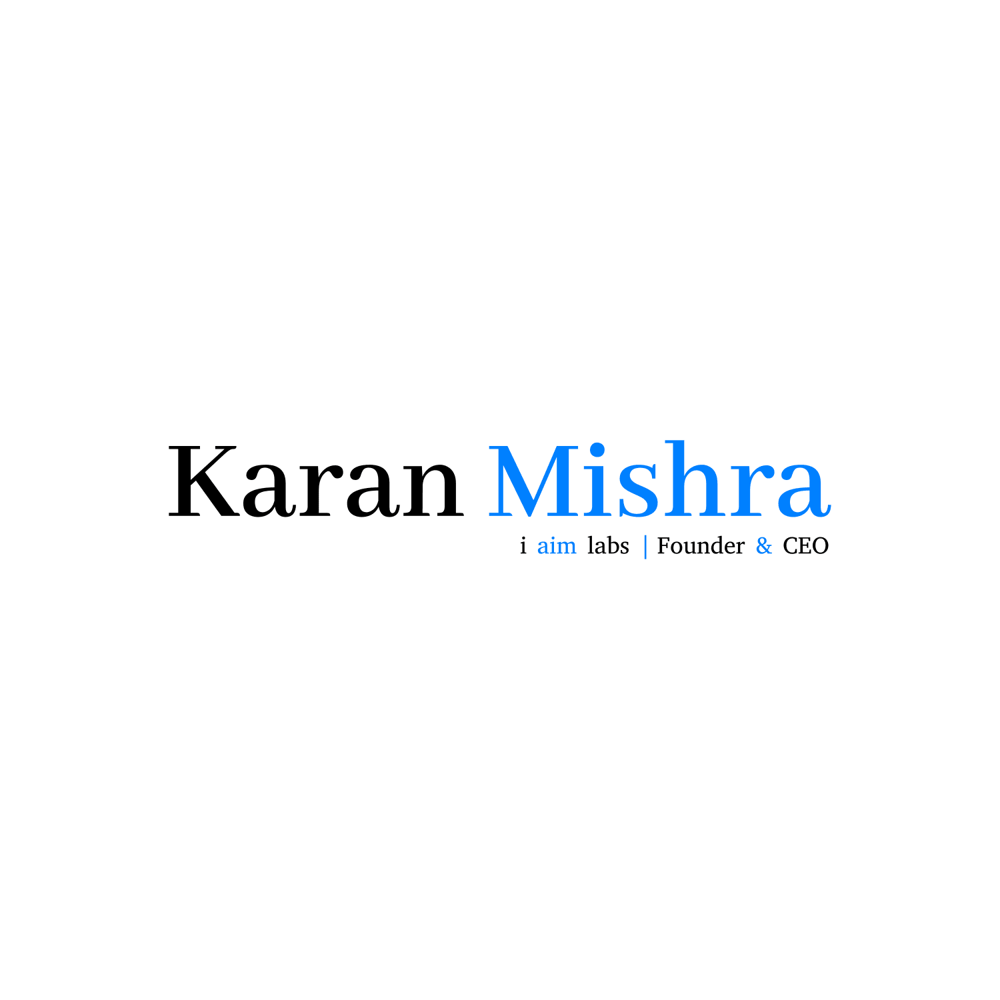

<div align="center">



# Karan Mishra | Founder, Aurxon
### Autonomous AI Platforms &bull; Industrial FCOS &bull; Agentic Neural Systems

[](https://nextjs.org/)
[](https://www.typescriptlang.org/)
[](https://firebase.google.com/)
[](https://www.sqlite.org/)
[](https://tailwindcss.com/)
[](https://opensource.org/licenses/MIT)

<p align="center">
  <a href="https://itsgkaranmishra.web.app"><strong>🌐 Live Portfolio</strong></a> &bull;
  <a href="https://itsgkaranmishra.web.app/admin"><strong>🛡️ Admin Command Center</strong></a> &bull;
  <a href="https://itsgkaranmishra.web.app/card"><strong>📇 9:16 Digital Smart Card</strong></a> &bull;
  <a href="https://itsgkaranmishra.web.app/blog"><strong>📝 Technical Insights Blog</strong></a>
</p>

</div>

---

## 🚀 Executive Overview

Welcome to the flagship portfolio repository of **Karan Mishra**, Founder at **Aurxon** and Machine Learning &amp; Python Engineer. 

This platform is an enterprise-grade web application built on **Next.js 14 App Router**, featuring the **Gravity Cosmos Neural Universe background**, a **10X Administrative Intelligence Portal**, a **Dynamic CMS (Blogs, Projects, Client Endorsements)**, **Deep Visitor Telemetry**, and a **9:16 Portrait Digital Smart Business Card with live auto-generated QR code**.

```
Live URLs:
├── Public Portfolio:     https://itsgkaranmishra.web.app
├── Mirror CDN:           https://itsgkaranmishra.firebaseapp.com
├── Admin Command Center: https://itsgkaranmishra.web.app/admin
├── 9:16 Digital Card:    https://itsgkaranmishra.web.app/card
└── Technical Blog:       https://itsgkaranmishra.web.app/blog
```

---

## 🧠 Core Engineering Architectures &amp; Research

### 1. FCOS (Factory Central Operating System) – Evolution from AIMS
Originally conceived as **AIMS (Artificial Intelligence Manufacturing System)** for machine telemetry and vibration analysis, Aurxon re-architected the platform into **FCOS**:
* **Deterministic Edge Inference:** Sub-12ms localized tensor execution beside PLC hardware via OPC-UA.
* **Closed-Loop Actuation:** Autonomous spindle feed modulation and load balancing to eliminate unscheduled CNC downtime.
* **Energy Arbitrage:** Dynamic synchronization of heavy shop-floor motors with real-time power grid tariff APIs.
* **Multimodal Operator Copilot:** Real-time visual diagnosis and augmented repair guidance for shop-floor supervisors.

### 2. ALAMS (Autonomous Learning Agentic Management Systems)
* **Tri-Agent Consensus Loop:** Tripartite architecture utilizing a *Planner Agent*, *Execution Pool*, and adversarial *Critic Agent* to achieve near-zero hallucination rates (<0.02%).
* **Vectorized Episodic Memory (VEM):** Persistent heurstic indexing across vendor contract formats and complex ERP data models.
* **Cryptographic Human-in-the-Loop Gateways:** High-stakes transaction verification via Slack and WhatsApp.

### 3. Aurxon Neural ERP Engine
* **Dual-Layer Architecture:** Strict ACID-compliant transactional financial ledgers (L1) coupled with probabilistic deep learning supply chain forecasting (L2).
* **Predictive Inventory Replenishment:** Dynamic continuous probability distribution modeling over supplier delivery lead times.

### 4. Cognivex &amp; HemoAI – Computer Vision
* Microscopic peripheral blood smear morphology segmentation (98.4% IoU with attention-gated U-Nets) and sub-second edge quantization on low-cost laboratory attachments.

---

## 🌟 10X Administrative &amp; Intelligence Capabilities

| Module | Features &amp; Architecture |
|---|---|
| **🛡️ Admin Security Gate** | Protected authentication at `/admin` (Username: `karann`). Credentials documented in `admin_credentials.txt`. |
| **📊 Visual Analytics** | Interactive 7-Day &amp; 30-Day traffic velocity bar charts, referrer channel attribution, device hardware splits, and conversion funnel. |
| **💼 Leads CRM (Full CRUD)** | Track client opportunities, pipeline statuses (`New` &rarr; `Contacted` &rarr; `In-Discussion` &rarr; `Converted`), priority badges, private admin notes, 1-click email/WhatsApp dispatch, and One-Click CSV export. |
| **📝 Dynamic Blog CMS (CRUD)** | Post, edit, update, and delete rich technical articles with real-time site-wide reflection on `/blog` and `/single-blog`. |
| **🚀 Projects CMS (CRUD)** | Add, edit, reorder, or delete portfolio projects and live deployment demos directly from the interface. |
| **⭐ Client Feedback Hub (CRUD)** | Interactive public feedback review widget on the homepage; 1-click admin approval/moderation pipeline. |
| **🌍 Deep Visitor Telemetry** | Captures Client Public IP (with 1-click copy), Geolocation (City, State, Country, Country Flag Emoji), ISP/Org, Screen Resolution, User Timezone, System Locale, Connection Type, and navigation path history. |
| **✉️ Direct Email Dispatch** | Zero-friction contact forms (`ModernContactSection.tsx` &amp; `/contact`) dispatching directly into `karannmishra136@gmail.com` without opening any client mail app. |

---

## 📇 9:16 Portrait Digital Smart Business Card (`/card`)

A luxury, interactive digital business card optimized for smartphones, networking events, and QR sharing:
* **9:16 Portrait Ratio:** Formatted to standard mobile screens and social story aspect ratios.
* **Auto-Generated Live QR Code:** Instantly generates a clean QR code encoding `https://itsgkaranmishra.web.app`. Scanning with any phone camera opens the portfolio and neural demos immediately.
* **1-Click vCard (.vcf) Export:** Visitors can tap **"📲 Save Contact (vCard)"** to automatically save Karan Mishra's phone, email, company, and links directly to their Apple/Android address book.
* **Web Share Integration:** One-click card link sharing across LinkedIn, WhatsApp, and Twitter.

---

## 🛠️ Technology Stack

* **Framework:** [Next.js 14](https://nextjs.org/) (App Router, Static Export `output: 'export'`)
* **Language:** [TypeScript](https://www.typescriptlang.org/)
* **Hosting &amp; CDN:** [Google Firebase Hosting](https://firebase.google.com/) (`cleanUrls: true`)
* **Database &amp; Storage:** [SQLite3](https://www.sqlite.org/) relational engine (`src/lib/db.ts`) &amp; reactive client CMS store (`src/lib/cms-store.ts`)
* **Styling &amp; Animations:** Vanilla CSS3, [Tailwind CSS](https://tailwindcss.com/), Bootstrap Grid, Glassmorphism, and Fluid Typography
* **Interactive Background:** HTML5 Canvas Gravity Cosmos Neural Particles
* **CI/CD:** [GitHub Actions](https://github.com/features/actions) with automated Firebase deployment on push to `main`

---

## 💻 Local Development Setup

### 1. Clone the Repository
```bash
git clone git@github.com:CodeSage4D/itsgkaranmishra.git
cd itsgkaranmishra
```

### 2. Install Dependencies
```bash
npm install
```

### 3. Run Development Server
```bash
npm run dev
```
Open [http://localhost:3000](http://localhost:3000) in your browser.

### 4. Build &amp; Validate Static Export
```bash
npm run build
```
Compiles and prerenders all pages (`/`, `/about`, `/services`, `/portfolio`, `/blog`, `/single-blog`, `/contact`, `/card`, `/admin`) directly into the `out/` directory.

### 5. Automated Deployment
Every commit pushed to the `main` branch automatically triggers the GitHub Actions workflow [firebase-hosting-merge.yml](.github/workflows/firebase-hosting-merge.yml) to deploy live to `https://itsgkaranmishra.web.app`.

---

## 📬 Contact &amp; Connect

* **Founder &amp; Chief AI Architect:** Karan Mishra
* **Company:** Aurxon (Next Gen AI Solutions &bull; Where Intelligence Meets Innovation)
* **Official Website:** [aurxon.com](https://aurxon.com)
* **Direct Email:** [karannmishra136@gmail.com](mailto:karannmishra136@gmail.com)
* **Phone / WhatsApp:** [+91 7804895074](tel:+917804895074) / [Chat on WhatsApp](https://wa.me/917804895074)
* **GitHub:** [@CodeSage4D](https://github.com/CodeSage4D)
* **LinkedIn:** [linkedin.com/in/itsgkaranmishra4](https://www.linkedin.com/in/itsgkaranmishra4)
* **Headquarters:** AURXON Headquarters, Killa Maidan, VIP Road, Indore, Madhya Pradesh – 452006, India

---

<div align="center">
  <sub>Designed &amp; Engineered by Karan Mishra &bull; &copy; 2026 Aurxon. All rights reserved.</sub>
</div>
